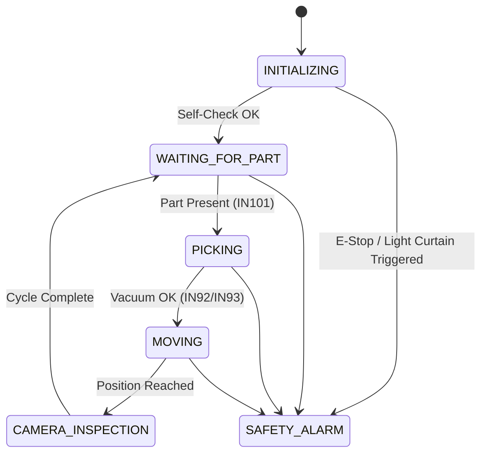

# Foam Placement Machine Digital Twin (SCARA Robot Cell Control & Telemetry System)

This project implements a finite state machine (FSM) driven control and real-time telemetry system for a SCARA robot production cell. It maps PLC inputs/outputs to a Python-based state machine and broadcasts system telemetry via Apache Kafka.

The architecture follows the Purdue Enterprise Reference Architecture (PERA), isolating machine control (Level 1/2) from data ingestion and analytics (Level 3/4).

## System Architecture

The project bridges industrial automation with modern software engineering practices:

- **Level 1 (Basic Control):** PLC IO execution mapping based on the SCARA Robot wiring diagrams.
- **Level 2 (Area Control):** Python Finite State Machine (FSM) acting as the simulator/controller brain.
- **Level 3 (Operations):** Real-time data streaming via Apache Kafka for telemetry and diagnostics.

## Table of Contents

- Features
- Project structure
- IO mapping overview
- Finite State Machine (FSM)
- Kafka telemetry schema
- Getting started

## Features

- **Industrial IO Mapping:** Comprehensive digital input/output translation from electrical schemas (documents/SCARA ROBOT BAĞLANTIN ŞEMASI (1).xlsx).
- **State Machine Controller:** Python FSM handling safe state transitions (e.g., `INITIALIZING`, `PICKING`, `CAMERA_INSPECTION`, `EMERGENCY_STOP`).
- **Vacuum Control Logic:** Feedback synchronization for dual-vacuum grippers (Model 1477 & 1480) with blow-off sequences.
- **Safety Interlocks:** Monitoring of light curtains, door/vibration sensors, and hardware E-Stop switches.
- **Data Streaming Pipeline:** Low-latency telemetry broadcasting to Kafka topics for analytics.

## Project structure

```
├── config/
│   └── io_mapping.yaml       # PLC register ve yazılım eşleşmeleri
├── core/
│   ├── __init__.py
│   ├── fsm.py                # Python Finite State Machine motoru
│   └── states.py             # System State Enums (INITIALIZING, PICKING vb.)
├── telemetry/
│   ├── __init__.py
│   └── kafka_producer.py     # State değiştikçe Kafka'ya veri basan ajan
├── consumer/
│   ├── __init__.py
│   └── consumer.py           # Kafka'yı dinleyip veritabanına (DB) yazan servis
├── database/                 # Opsiyonel: DB bağlantı ve şema ayarları
│   ├── __init__.py
│   └── models.py             # Zaman serisi veya ilişkisel DB modelleri
├── .env                      # Kafka broker adresleri, DB şifreleri vb.
├── docker-compose.yml        # Kafka, Zookeeper, DB ve Python servisleri
├── main.py                   # FSM ve Telemetry'yi başlatan ana giriş kapısı
├── requirements.txt          # Bağımlılıklar (confluent-kafka, pyyaml vb.)
└── README.md
```

## IO mapping overview

The system processes physical IO mapped into software variables. The full, canonical mapping is stored in [config/io_mapping.yaml](config/io_mapping.yaml). A condensed, human-readable view follows.

### Digital Inputs (DI)

| PLC address | Sheet tag | Description (English) | Notes |
|-------------|-----------|-----------------------|-------|
| I0.0 | IN81  | Start (BAŞLA)                                 | Start push / auto-start |
| I0.1 | IN82  | Light curtain (IŞIK BARİYERİ)                 | Safety curtain input |
| I0.2 | IN83  | Reset switch (RESET ANAHTARI)                 | Operator reset |
| I0.3 | IN84  | Rotary forward (ROTARY İLERİ)                 | Rotary encoder/button |
| I0.4 | IN85  | Rotary backward (ROTARY GERİ)                 | |
| I0.5 | IN86  | Linear gripper forward (LİNEAR TUTUCU İLERİ)  | |
| I0.6 | IN87  | Linear gripper back (LİNEAR TUTUCU GERİ)      | |
| I0.7 | IN88  | Linear pulling cylinder forward               | |
| I1.0 | IN89  | Linear pulling cylinder back                  | |
| I1.1 | IN90  | Linear locking cylinder forward               | |
| I1.2 | IN91  | Linear locking cylinder back                  | |
| I1.3 | IN92  | 1477 left vacuum OK                            | Sensor OK flag |
| I1.4 | IN93  | 1477 right vacuum OK                           | |
| I1.5 | IN94  | 1480 left vacuum OK                            | |
| I1.6 | IN95  | 1480 right vacuum OK                           | |
| I1.7 | IN96  | Right box inner barrier (SAĞ KASA İÇİ BARİYER) | Safety input |
| I2.0 | IN97  | Left box inner barrier                         | Safety input |
| I2.1 | IN98  | Reject part pushbutton (RED PARÇA BUTON)      | Reject request |
| I2.2 | IN99  | Robot mode (ROBOTLU)                          | Mode selector |
| I2.3 | IN100 | Robotless mode (ROBOTSUZ)                     | Mode selector |
| I2.4 | IN101 | Sponge pick-up area sensor                     | |
| I2.5 | IN102 | Tool sponge present                            | |
| I2.6 | IN103 | 1477 rotary table                              | |
| I2.7 | IN104 | 1480 rotary table                              | |
| I3.0 | IN105 | Door & vibration safety                        | Safety interlock |
| I3.1 | IN106 | Emergency stop (ACİL STOP)                     | E-stop pressed |
| I3.2 | IN107 | Table clamp forward                            | |
| I3.3 | IN108 | Table clamp back                               | |
| I3.4 | IN109 | Spare input 1                                  | Unused |
| I3.5 | IN110 | Spare input 2                                  | Unused |
| I3.6 | IN111 | Spare input 3                                  | Unused |
| I3.7 | IN112 | Spare input 4                                  | Unused |

### Digital Outputs (DO)

| PLC tag | Description (English) | Notes |
|---------|-----------------------|-------|
| OUT81  | Linear gripper actuator                            | |
| OUT82  | Linear locking cylinder                            | |
| OUT83  | Linear pulling cylinder                            | |
| OUT84  | Robot tool gripper                                 | Command to robot tool |
| OUT85  | 1477 needle insertion                              | |
| OUT86  | 1480 needle insertion                              | |
| OUT87  | Table clamp                                        | |
| OUT88  | Pilot warning valve (NC)                           | NC valve control |
| OUT89  | Pilot warning valve (duplicate/config)             | |
| OUT90  | Closed-center valve rotary forward                 | |
| OUT91  | Closed-center valve rotary back                    | |
| OUT92  | Closed-center valve forward                        | |
| OUT93  | Closed-center valve back                           | |
| OUT94  | 1477 left vacuum ON                                | Vacuum control |
| OUT95  | 1477 left vacuum blow-off                          | Vacuum blow-off |
| OUT96  | 1477 right vacuum ON                               | |
| OUT97  | 1477 right vacuum blow-off                         | |
| OUT98  | 1480 left vacuum ON                                | |
| OUT99  | 1480 left vacuum blow-off                          | |
| OUT100 | 1480 right vacuum ON                               | |
| OUT101 | 1480 right vacuum blow-off                         | |
| OUT102 | System air (compressor / air)                      | |
| OUT103 | Alarm output                                       | Audible/visual alarm |
| OUT104 | Green lamp (YEŞİL LAMBA)                           | Indicator |
| OUT105 | Right box full indicator                           | |
| OUT106 | Left box full indicator                            | |
| OUT107 | Camera exe command on                              | Camera control |
| OUT108 | Camera exe 1 on                                    | |
| OUT109 | Camera exe 2 on                                    | |
| OUT110 | Camera exe acknowledge                             | |
| OUT111 | Lighting (AYDINLATMA)                              | |
| OUT112 | Spare output (BOŞ2)                                | Unused |

## Finite State Machine (FSM)

The FSM enforces safe transitions to prevent illegal operations (for example, moving while vacuum feedback is lost). The diagram below uses Mermaid syntax.



## Kafka telemetry schema

The pipeline serializes register states and emits an event to the `scara.telemetry.v1` topic on state transitions or heartbeat ticks. Example message:

```json
{
  "timestamp": "2026-06-29T08:35:00Z",
  "current_state": "PICKING",
  "metrics": {
    "safety_curtain_ok": true,
    "emergency_stop_active": false,
    "vacuum_1477_left_ok": true
  },
  "actuators": {
    "robot_tool_gripper": true,
    "green_lamp": true
  }
}
```

## Getting started

### Prerequisites

- Python 3.10+ (tested on 3.12)
- Docker + Docker Compose (for Kafka, TimescaleDB, Grafana, and the consumer)

### Quick start - full stack (recommended)

Bring up Kafka (KRaft mode), TimescaleDB, Grafana, and the consumer service:

```bash
docker compose up -d
```

This starts:

| Service | Port | Notes |
|---|---|---|
| Kafka | `localhost:9092` (EXTERNAL) | dual listener: `kafka:29092` for containers, `localhost:9092` for host processes |
| TimescaleDB | `localhost:5432` | db=`foam_placement`, user=`foam_admin` (see `docker-compose.yml`) |
| Grafana | `localhost:3000` | login `admin` / `admin`; dashboard "Foam Placement Machine - Digital Twin" auto-provisioned |
| consumer | - | Kafka -> TimescaleDB micro-batch writer (50 records / 2s, whichever first) |

The FSM simulator (`main.py`) is **not** started by `docker compose up` by default - run it locally against the host-exposed Kafka port so you can iterate on it quickly:

```bash
python -m venv .venv
source .venv/bin/activate  # .venv\Scripts\Activate.ps1 on Windows
pip install -r requirements.txt
cp .env.example .env       # defaults already point at localhost:9092 / localhost:5432
python main.py
```

To containerize the simulator too instead: `docker compose --profile simulator up -d`.

### Verifying the pipeline

- `docker compose logs -f consumer` - should show `Flushed N events to TimescaleDB.` roughly every 2 seconds once `main.py` is running.
- Open Grafana at `http://localhost:3000` - the pre-provisioned dashboard shows kasa counters, error count over time, event distribution by state, a state timeline, and the last 20 raw events.
- `psql -h localhost -U foam_admin -d foam_placement -c "SELECT * FROM telemetry_events ORDER BY time DESC LIMIT 5;"` (password `foam_admin_pw`).

### Running tests

```bash
pip install pytest
python -m pytest tests/ -v
```

## Notes & next steps

- Add `License` and `Contributing` sections if this repo is public.
- Replace the placeholder `git clone` URL with your repository URL.
- `kafka-python` (the original PyPI package) is broken on Python 3.12 - this project uses `kafka-python-ng`, an actively maintained drop-in fork (same `import kafka` API). See the comment in `requirements.txt`.
- Grafana datasource/dashboard provisioning lives in `config/grafana/`; edit `config/grafana/dashboards/foam_placement.json` and Grafana will pick up changes within `updateIntervalSeconds` (30s).
